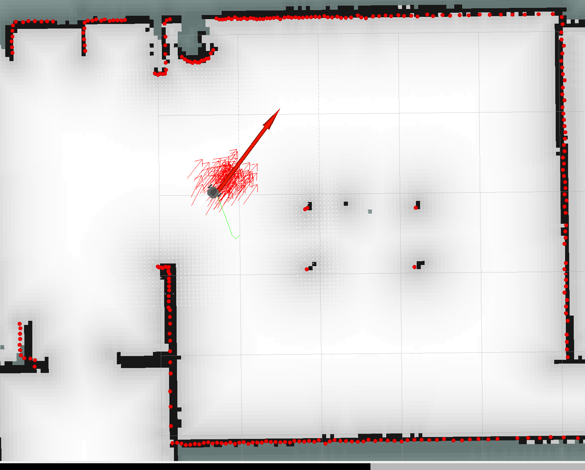

# Particle Filter Startup Guide

This README provides instructions on how to start the Particle Filter, including the necessary steps to prepare your environment, launch the simulation and the Particle Filter itself, and optional steps to visualize the results. Additionally, you'll find information on where to find the source code and parameters, as well as visual aids to help you understand the expected outcomes.

## Preparing Your Environment

Before running any commands, ensure that each new terminal session is properly set up by sourcing the ROS environment setup file:

```bash
source devel/setup.bash
```

## Steps to Run the Particle Filter

### 1. Start the Simulation

To begin, start the simulation environment. This can be done with the following command:

```bash
roslaunch sensor_fusion run_simulation.launch model:=burger
```

This command launches the simulation with the burger model. You can replace `burger` with another model name if your setup requires it.

### 2. Start the Particle Filter

Once the simulation is up and running, you can start the Particle Filter with:

```bash
roslaunch sensor_fusion particle_filter.launch
```

This command initializes the Particle Filter and begins processing the data from the simulation.

### Optional: Start the Plot

For visualizing the pose estimation in real-time, you can start a plot with:

```bash
rosrun sensor_fusion pose_plotter.py
```

This step is optional but recommended for a better understanding of how the Particle Filter performs.

## Parameters and Source Code

### Parameters

The Particle Filter and simulation can be customized through various parameters. These parameters can be found and adjusted in the launch files located in:

`sensor_fusion/launch/`

### Source Code

The core source code for the Particle Filter is located in:

`sensor_fusion/include/classes`

Here, you can explore the implementation details and potentially adjust the Particle Filter's behavior.

## Visual Aids

To help you understand what to expect, we've included a GIF and a photo of the Particle Filter in action:

**GIF: Particle Filter Demo**


**Video: Particle Filter Demo**


**Photo: Particle Filter Result**



Happy filtering!
